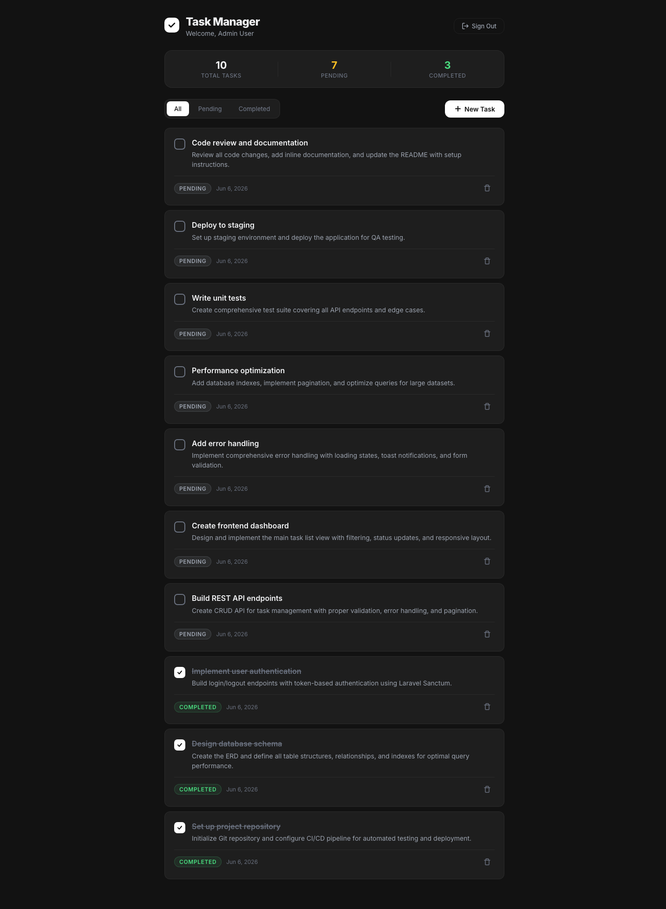

# Task Management System

A full-stack task management reference app with a Laravel API backend, Sanctum
token authentication, and a Next.js frontend. The project demonstrates a small
but complete task workflow: login, list tasks, filter by status, create tasks,
mark tasks complete, and delete tasks.

This repository is maintained as a practical open-source example app. It was
originally built from a technical-assessment style brief, and the current goal is
to make it easier for other developers to run, test, and extend honestly.

## Screenshot



## Tech stack

- Frontend: Next.js 16, React 19, TypeScript, CSS Modules
- Backend: Laravel 13, PHP 8.3+, Laravel Sanctum
- Database: SQLite for local development and tests
- Tooling: PHPUnit, ESLint, GitHub Actions, Dependabot

## Repository structure

```text
.
├── backend/   # Laravel API, database migrations, feature tests
├── frontend/  # Next.js client app
└── .github/   # CI, issue templates, pull request template, Dependabot
```

## Prerequisites

- PHP 8.3 or newer
- Composer 2
- Node.js 20 or newer
- npm

## Quickstart

Run the backend in one terminal:

```bash
cd backend
composer install
cp .env.example .env
php artisan key:generate
php artisan migrate --seed
php artisan serve
```

The API runs at `http://127.0.0.1:8000`.

Run the frontend in another terminal:

```bash
cd frontend
npm install
npm run dev
```

The frontend defaults to `http://127.0.0.1:8000/api`. To point it at another
API, create `frontend/.env.local` with `NEXT_PUBLIC_API_URL=<your API URL>`.

Open `http://localhost:3000` and log in with the seeded demo account:

- Email: `admin@example.com`
- Password: `password`

The demo seed creates a maintainer-friendly task board with completed and
pending tasks so new contributors can inspect the full workflow immediately.
The API exposes login and task endpoints under `/api`.

To reset the demo data during local development:

```bash
cd backend
php artisan migrate:fresh --seed
```

## API overview

Public endpoint:

- `POST /api/login`

Authenticated endpoints:

- `GET /api/me`
- `POST /api/logout`
- `GET /api/tasks`
- `POST /api/tasks`
- `GET /api/tasks/{task}`
- `PUT /api/tasks/{task}`
- `DELETE /api/tasks/{task}`

The task list supports pagination and optional `status` filtering.

## Development checks

Backend:

```bash
cd backend
composer install
cp .env.example .env
php artisan key:generate
php artisan test
```

Frontend:

```bash
cd frontend
npm install
npm run lint
npm run build
npm audit --audit-level=moderate
```

CI runs the same backend and frontend checks on pushes to `main` and pull
requests.

## Security

Do not commit `.env` files, API keys, tokens, private certificates, database
dumps, or local logs. See `SECURITY.md` for vulnerability reporting.

## Roadmap

- Add frontend component tests for the task form and auth flow.
- Add API documentation with request and response examples.
- Add release tags once the project has a stable demo setup.

## Demo data

`backend/database/seeders/DatabaseSeeder.php` creates one demo user and ten
sample tasks. The seeder is idempotent, so rerunning it refreshes missing demo
records without duplicating existing tasks.

## Maintainer note

This project is owned and maintained by `Decker7`. Contributions should stay
small, testable, and focused on improving the example app.

## License

MIT. See `LICENSE`.
